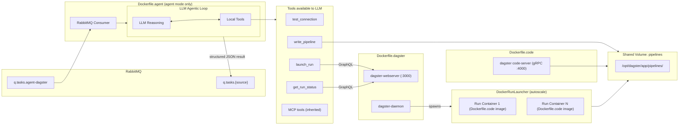
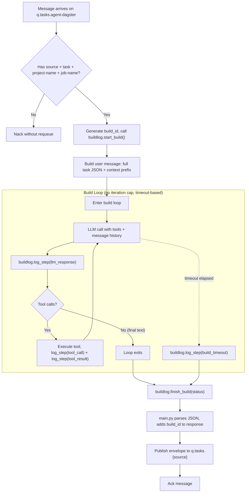

# Agent Dagster Implementation Plan

## Architecture Overview




## Two Operating Modes

**Agent mode** -- `docker compose -f docker-compose.yml -f docker-compose.agent.yml up`
Starts the full Dagster stack (db, webserver, daemon, code location) PLUS the agent container. The agent listens for tasks on RabbitMQ, generates code, launches runs, and reports back. You monitor progress via the Dagster UI at `:3000`.

**Dagster-only mode** -- `docker compose up`
Starts only the Dagster stack (db, webserver, daemon, code location). No agent, no RabbitMQ dependency. Previously generated pipelines on the volume are available. Runs autoscale via `DockerRunLauncher` which spawns new containers from the `Dockerfile.code` image. This is the production execution mode.

## Deviation from agent-base

The FastAPI HTTP API, Redis registry/context, and config system are **unchanged**. The deviations are:

### Extended agent loop (`app/agent.py`)

The base `_arun` loop has a hard `max_iterations=10` cap and no step-level logging. For agent-dagster the loop is replaced:

- **No hard iteration cap.** The loop runs until the LLM returns a final text response (no tool calls) OR a configurable `build_timeout_seconds` elapses (default 600s via `config.yaml`). A complex build might take 30-50+ iterations (generate code, test connection, revise, write, launch, poll status repeatedly, evaluate output, iterate).
- **Context refresh every iteration.** Before each LLM call, the loop re-reads all subscribed Redis context streams and compares against the last-seen message IDs. If new entries have appeared since the previous iteration, they're injected into the conversation as a system message (e.g., `"New context received: [agent-dagster] source_connection: {...}"`). This means if someone publishes connection credentials or other info to a context stream mid-build, the agent picks it up on the very next iteration -- no tool call needed, no delay.
- **Local tools** from `app/tools.py` are registered alongside MCP tools. When the LLM calls a local tool, the handler invokes the Python function directly instead of going through MCP.
- **Step logging**: every iteration is logged to Redis via `app/buildlog.py`, keyed by a `build_id` generated at the start of the run. Logged events:
  - `llm_response` -- the assistant's text/reasoning each turn
  - `tool_call` -- tool name + arguments
  - `tool_result` -- tool output or error
  - `context_update` -- new context entries injected mid-build
  - `build_complete` / `build_timeout` -- terminal events

### Other changes

- `**app/context.py**`: New function `get_new_entries(last_ids: dict[str, str]) -> tuple[list[dict], dict[str, str]]`. Reads all subscribed context streams using `XREAD` starting from `last_ids` (a map of stream name to last-seen message ID). Returns any new entries + the updated ID map. The base `build_prefix()` is still used for the initial context load; `get_new_entries` handles the incremental refresh each iteration.
- `**app/main.py**`: `_on_message` validates only the hard-required keys, generates a `build_id` (UUID), passes it + the full payload to `agent.run()`. Parses the structured JSON response into the standard envelope. The `build_id` is included in the response so the PM can look up the full build log.
- **New `app/tools.py**`: Local tool functions + OpenAI function schemas.
- **New `app/buildlog.py**`: Redis-backed per-build step log. Keys use `{project}:{job}:{build_id}` for prefix scanning. Includes `container_id` in metadata to track which agent instance handled each build.
- `**app/api.py**`: New endpoints: `GET /build-logs` (all recent builds), `GET /build-logs/{project}/{job}` (builds for a job), `GET /build-logs/{project}/{job}/{build_id}` (full step history).
- **New `dagster/definitions.py**`: Dynamic Dagster code location.
- **New `dagster/dagster.yaml` / `dagster/workspace.yaml**`: Dagster instance config using `DockerRunLauncher`.
- **Three Dockerfiles** (agent, dagster host, code location).
- **Two compose files**: base `docker-compose.yml` + agent overlay `docker-compose.agent.yml`.
- `**Pipfile**`: Adds `dagster`, `dagster-webserver`, `dagster-docker`, `dagster-graphql`, `dagster-postgres`.

## Task Format

### Minimum viable task (required fields)

```json
{
  "source": "console",
  "task": "Pull from the users table, remove nulls, export to CSV",
  "project-name": "etl-users",
  "job-name": "clean-and-export"
}
```

`project-name` maps to a subdirectory, `job-name` maps to the Python module filename. The `task` field is the natural language description sent to the LLM along with structured guidance.

### Suggested full ETL task structure

Credentials can live in the task payload or in a Redis context stream the agent subscribes to. If neither provides them, the agent replies with a `pending` status asking for the missing details.

```json
{
  "source": "pm",
  "task": "Extract all rows from the users table updated in the last 7 days, normalize email addresses to lowercase, deduplicate by user_id, and load into the analytics.clean_users table",
  "project-name": "user-analytics",
  "job-name": "weekly-user-sync",
  "source_connection": {
    "type": "postgres",
    "host": "source-db.internal",
    "port": 5432,
    "database": "production",
    "schema": "public",
    "table": "users",
    "credentials_key": "prod-pg-readonly"
  },
  "target_connection": {
    "type": "postgres",
    "host": "warehouse.internal",
    "port": 5432,
    "database": "warehouse",
    "schema": "analytics",
    "table": "clean_users",
    "credentials_key": "warehouse-rw"
  },
  "options": {
    "incremental_key": "updated_at",
    "lookback_days": 7,
    "dedup_key": "user_id",
    "write_mode": "upsert"
  }
}
```

Field notes:

- `source_connection` / `target_connection`: Where to read from and write to. The `credentials_key` references a secret name resolvable from context streams (e.g. a Redis entry under `context:agent-dagster` with the actual connection string). If the full `host`/`port`/`database` are provided inline, the agent uses those directly.
- `options`: Hints for the LLM to generate appropriate pipeline logic (incremental loads, dedup strategy, write mode).
- All fields beyond `source`, `task`, `project-name`, `job-name` are optional. The agent inspects what's available and asks for what's missing.

## Response Protocol

The envelope is always the same four keys -- identical to the base agent protocol. The PM consumer never needs to branch on structure. All detail lives inside the `response` object.

```
{
  "task":         <original task payload, echoed back>,
  "response":     <structured object with status + detail>,
  "source":       "agent-dagster",
  "container_id": "a1b2c3d4"
}
```

### Success

```json
{
  "task": { "source": "pm", "task": "Extract all rows ...", "project-name": "user-analytics", "job-name": "weekly-user-sync" },
  "response": {
    "status": "complete",
    "summary": "Job weekly-user-sync completed successfully. 1,247 rows synced.",
    "run_id": "abc123-def456",
    "build_id": "550e8400-e29b-41d4-a716-446655440000"
  },
  "source": "agent-dagster",
  "container_id": "a1b2c3d4"
}
```

### Pending (missing info)

```json
{
  "task": { "source": "pm", "task": "Extract all rows ...", "project-name": "user-analytics", "job-name": "weekly-user-sync" },
  "response": {
    "status": "pending",
    "summary": "Task pending: please provide source connection details for 'production.public.users'. No credentials found in task payload or context streams.",
    "missing": ["source_connection"],
    "build_id": "550e8400-e29b-41d4-a716-446655440000"
  },
  "source": "agent-dagster",
  "container_id": "a1b2c3d4"
}
```

### Failure

```json
{
  "task": { "source": "pm", "task": "Extract all rows ...", "project-name": "user-analytics", "job-name": "weekly-user-sync" },
  "response": {
    "status": "failed",
    "summary": "Job weekly-user-sync failed: connection refused to source-db.internal:5432",
    "run_id": "abc123-def456",
    "build_id": "550e8400-e29b-41d4-a716-446655440000"
  },
  "source": "agent-dagster",
  "container_id": "a1b2c3d4"
}
```

The `response` object always has `status` (`complete` | `pending` | `failed`), `summary` (human-readable), and `build_id` (UUID for looking up the full step trace via `/build-logs/{build_id}`). Additional keys like `run_id` or `missing` appear only when relevant. The `task` key echoes back the entire original payload so the PM has full context without needing to correlate.

## File-by-File Changes

### Modified from agent-base

- **[app/main.py](agent-dagster/app/main.py)**: `_on_message` validates only the hard-required keys (`source`, `task`, `project-name`, `job-name`). Generates a `build_id` (UUID). Serializes the full task payload into the user message, calls `agent.run(user_message, build_id=build_id)`. Parses the agent's final text response as JSON. Adds `build_id` to the response object, wraps into the standard envelope, publishes to `q.tasks.{source}`.
- **[app/agent.py](agent-dagster/app/agent.py)**: Replaces the base `_arun` with an extended build loop:
  - Accepts `build_id` parameter. Calls `buildlog.start_build()` at entry.
  - Registers local tools from `app/tools.py` alongside MCP-discovered tools.
  - **No hard iteration cap** -- loops until the LLM returns final text (no tool calls) OR `build_timeout_seconds` elapses. Each iteration: log the LLM response, dispatch any tool calls (logging each call + result), feed results back.
  - On timeout: logs `build_timeout`, returns a timeout error JSON.
  - On clean exit: logs `build_complete`, calls `buildlog.finish_build()`.
- **[app/api.py](agent-dagster/app/api.py)**: Three new endpoints added *before* the `/{key}` catch-all:
  - `GET /build-logs?limit=50` -- list recent builds with metadata (build_id, project, job, status, container_id, started_at, finished_at).
  - `GET /build-logs/{project}/{job}?limit=50` -- list builds for a specific project/job.
  - `GET /build-logs/{project}/{job}/{build_id}` -- full step-by-step history for a specific build.
- **[config.yaml](agent-dagster/config.yaml)**: Add to the `editable:` section (so they're changeable at runtime via the API): `dagster_graphql_url` (default `http://dagster-webserver:3000/graphql`), `pipelines_dir` (default `/opt/dagster/app/pipelines`), `build_timeout_seconds` (default `600`). Update `prompt` to the Dagster agent system prompt.
- **[Pipfile](agent-dagster/Pipfile)**: Add `dagster`, `dagster-webserver`, `dagster-docker`, `dagster-graphql`, `dagster-postgres`.
- **[README.md](agent-dagster/README.md)**: Full rewrite with task format, Dockerfile descriptions, two operating modes, build log API, volume setup, and autoscaling notes.

### New files -- agent tools and build log

`**app/tools.py**` -- tools the LLM calls during the build loop. Each is a Python function + OpenAI function schema:

- `**test_connection(type, host, port, database, user, password)**` -- Attempts a real connection to the given database/service. Returns success or the error message.
- `**write_pipeline(project_name, job_name, code)**` -- Validates syntax via `compile()`, writes to `{pipelines_dir}/{project_name}/{job_name}.py`, creates `__init__.py` if needed. Returns the file path or a syntax error.
- `**launch_run(project_name, job_name)**` -- Sends a `launchRun` mutation to the Dagster GraphQL API. Returns the `run_id`.
- `**get_run_status(run_id)**` -- Queries the Dagster GraphQL API for run status + log tail. Returns status string and recent log lines.

`**app/buildlog.py**` -- Redis-backed per-build step log (same pattern as `tasklog.py`):

Redis keys use `{project}:{job}:{build_id}` so they're prefix-scannable by project or project+job:

- `builds:meta:{project}:{job}:{build_id}` -- hash with project, job, status, started_at, finished_at, container_id
- `builds:steps:{project}:{job}:{build_id}` -- list of timestamped JSON step entries
- `builds:index` -- sorted set of `{project}:{job}:{build_id}` scored by timestamp for global listing

Functions:

- `**start_build(build_id, project_name, job_name, container_id)**` -- Creates the metadata hash (including `container_id` to track which agent instance handled it) and adds the composite key to `builds:index`.
- `**log_step(build_id, project_name, job_name, step_type, content)**` -- Appends a timestamped step to the list. Step types: `llm_response`, `tool_call`, `tool_result`, `build_complete`, `build_timeout`, `build_error`.
- `**finish_build(build_id, project_name, job_name, status)**` -- Updates the metadata hash with final status + finished_at.
- `**get_build_log(project_name, job_name, build_id)**` -- Returns the full step list for a specific build.
- `**list_builds(limit)**` -- Returns recent build metadata from the sorted set, most recent first.
- `**list_builds_for_job(project_name, job_name, limit)**` -- Uses `SCAN` for `builds:meta:{project}:{job}:*` to list all builds for a specific project/job.

The LLM's system prompt instructs it to use tools as needed and return a final JSON response. The agent is free to call tools in whatever order -- test connections, generate and revise code multiple times, launch runs, poll status in a loop, query source/target schemas, etc. The loop continues until the agent is satisfied or hits an unresolvable blocker.

### New files -- Dagster infrastructure

- `**dagster/definitions.py**`: Dynamic code location. Walks the pipelines volume directory, imports each module, collects all `@job`-decorated objects into a `Definitions`. This is what the code-server exposes via gRPC and what run containers load.
- `**dagster/dagster.yaml**`: Instance config with `PostgresRunStorage` + `PostgresEventLogStorage` + `PostgresScheduleStorage` pointing to `dagster-db`, and `DockerRunLauncher` configured with the code location image, pipelines volume mount, and Docker network.
- `**dagster/workspace.yaml**`: Points to the code-server gRPC endpoint (`code-location:4000`).

### New files -- three Dockerfiles

- `**Dockerfile.agent**`: `python:3.12-slim`. Installs all Pipfile deps (FastAPI + RabbitMQ + Dagster). Entrypoint: `uvicorn app.main:app`. Mounts pipelines volume so the builder writes generated code there.
- `**Dockerfile.dagster**`: `python:3.12-slim`. Installs only dagster host packages (`dagster`, `dagster-webserver`, `dagster-postgres`, `dagster-docker`). Copies `dagster.yaml` + `workspace.yaml` into `$DAGSTER_HOME`. No user code. Used for webserver and daemon via entrypoint override. Daemon container mounts Docker socket to spawn run containers.
- `**Dockerfile.code**`: `python:3.12-slim`. Installs `dagster`, `dagster-postgres`, `dagster-docker`. Copies `dagster/definitions.py`. Mounts the pipelines volume at `/opt/dagster/app/pipelines`. Entrypoint: `dagster code-server start -h 0.0.0.0 -p 4000 -f definitions.py`. Also the image `DockerRunLauncher` uses to spawn autoscaled run containers (set via `DAGSTER_CURRENT_IMAGE` env var).

### Compose files

`**docker-compose.yml**` -- dagster-only base (runs without agent):

- `dagster-db` -- `postgres:16`, Dagster run/event/schedule storage
- `code-location` -- `Dockerfile.code`, gRPC server on `:4000`, `DAGSTER_CURRENT_IMAGE` set to own image, healthcheck via `dagster api grpc-health-check`
- `dagster-webserver` -- `Dockerfile.dagster`, UI on `:3000`, depends on db + code-location, mounts Docker socket
- `dagster-daemon` -- `Dockerfile.dagster`, depends on db + code-location, mounts Docker socket
- Named volumes: `pipelines` (at `/opt/dagster/app/pipelines`), `io_manager_storage`, `dagster_pg_data`
- Network: `dagster-network` (bridge)

`**docker-compose.agent.yml**` -- agent overlay (extends base):

- `agent-dagster` -- `Dockerfile.agent`, port `:8000`, depends on `dagster-webserver` + `rabbitmq` + `cache`, joins `dagster-network`, mounts `pipelines` volume
- `rabbitmq` -- extends from `../agent-queue/docker-compose.yml`
- `cache` -- Redis `7-alpine`, same pattern as agent-base

Usage:

- Dagster-only: `docker compose up`
- Agent mode: `docker compose -f docker-compose.yml -f docker-compose.agent.yml up`

## Task Processing Flow




Step-by-step:

1. Message arrives on `q.tasks.agent-dagster`.
2. Validate only hard-required keys: `source`, `task`, `project-name`, `job-name` (nack if missing).
3. Generate a `build_id` (UUID). Call `buildlog.start_build(build_id, project_name, job_name)`.
4. Build user message: full task JSON payload prepended with context from Redis streams.
5. Call `agent.run(user_message, build_id=build_id)`. This enters the build loop:
  - Each LLM turn is logged via `buildlog.log_step(build_id, "llm_response", ...)`.
  - Each tool call is logged via `buildlog.log_step(build_id, "tool_call", ...)`.
  - Each tool result is logged via `buildlog.log_step(build_id, "tool_result", ...)`.
  - The LLM drives the workflow -- it might test connections, generate code, write it, discover a syntax error, revise, write again, launch a run, poll status 5 times, evaluate output, etc. There is no hard iteration cap.
  - If `build_timeout_seconds` elapses, the loop exits with a timeout error.
  - When the LLM returns final text (no tool calls), the loop exits cleanly.
6. `buildlog.finish_build(build_id, status)` records the final state.
7. `main.py` parses the agent's final text as JSON, adds `build_id` to the response object, wraps into the standard four-key envelope, publishes to `q.tasks.{source}`, and acks.

The system prompt instructs the agent to always end with a JSON object:

```json
{"status": "complete|pending|failed", "summary": "...", "run_id": "...", "missing": [...]}
```

`run_id`, `missing`, and `build_id` are included only when relevant. `build_id` is always added by `main.py` so the PM can query `/build-logs/{build_id}` for the full step trace.